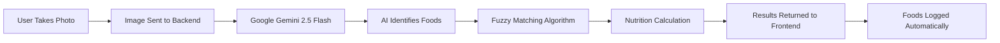

# Afyniq Documentation 🇰🇪

## Table of Contents
- [What is Afyniq?](#what-is-Afyniq)
- [Who Can Use Afyniq?](#who-can-use-Afyniq)
- [Our Competitive Advantage](#our-competitive-advantage)
- [Key Features](#key-features)
- [How It Works](#how-it-works)
- [Technical Overview](#technical-overview)
- [Getting Started](#getting-started)

---

## What is Afyniq?

**Afyniq** is Kenya's first AI-powered calorie tracking application designed specifically for local Kenyan foods. Unlike generic calorie trackers that struggle with dishes like Ugali, Chapati, or Sukuma Wiki, Afyniq understands our food culture and makes nutrition tracking as simple as taking a photo.

### The Problem We Solve

Traditional calorie tracking apps have three major problems for Kenyan users:

1. **Missing Local Foods**: Most apps don't have Kenyan dishes in their database
2. **Manual Entry is Tedious**: Searching, selecting, and logging each food item takes too much time
3. **Inaccurate Portions**: Generic serving sizes don't match how we actually eat

### Our Solution

Afyniq combines:
- ✅ **Comprehensive Kenyan Food Database** - 20+ local dishes with accurate nutritional data
- ✅ **AI-Powered Food Recognition** - Just snap a photo, no manual searching
- ✅ **Realistic Portion Sizes** - Portions that match Kenyan eating habits (e.g., "Kibanda Thick" chapati, "Fist Size" ugali)

---

## Who Can Use Afyniq?

Afyniq is designed for **anyone in Kenya** who wants to track their nutrition, but it's especially valuable for:

### 🏋️ Fitness Enthusiasts
- **Bodybuilders & Athletes**: Track macros (protein, carbs, fats) for muscle gain or cutting phases
- **Gym-Goers**: Monitor calorie intake to support workout goals
- **Runners & Cyclists**: Ensure adequate energy intake for training

### 🩺 Health-Conscious Individuals
- **Weight Management**: Track calories to lose, maintain, or gain weight
- **Diabetics**: Monitor carbohydrate intake from local foods
- **People with Dietary Restrictions**: Keep track of specific macronutrients

### 👨‍⚕️ Healthcare Professionals
- **Nutritionists & Dietitians**: Use as a tool to help clients track Kenyan meals
- **Doctors**: Recommend to patients who need to monitor their diet
- **Health Coaches**: Support clients with accurate local food data

### 🎓 Students & Researchers
- **Nutrition Students**: Learn about Kenyan food nutritional values
- **Public Health Researchers**: Collect dietary data from Kenyan populations
- **Food Science Students**: Study local food composition

### 👨‍👩‍👧‍👦 Everyday Kenyans
- **Busy Professionals**: Quick meal logging without manual searching
- **Parents**: Track family nutrition with familiar foods
- **Anyone Curious**: Learn about the nutritional content of what you eat

---

## Our Competitive Advantage

### 🤖 AI-Powered Multi-Food Detection

**This is what sets Afyniq apart from every other calorie tracker.**

#### How Other Apps Work:
1. Open app
2. Search for food name
3. Select from list
4. Enter quantity
5. Repeat for each food item
6. **Total time: 2-3 minutes per meal**

#### How Afyniq Works:
1. Take a photo
2. AI automatically detects ALL foods
3. Nutrition logged instantly
4. **Total time: 5 seconds**

### Why Our AI is Superior

#### 🎯 Specialized for Kenyan Foods
- **Trained on Local Dishes**: Our AI uses Google Gemini 2.5 Flash with a specialized prompt that includes our Kenyan food database
- **Understands Context**: Recognizes Ugali vs. Rice, Chapati vs. Mandazi, Sukuma Wiki vs. Cabbage
- **Multi-Food Detection**: Can identify multiple items in one photo (e.g., Rice + Beef Stew + Sukuma Wiki)

#### 🧠 Intelligent Matching System
Our AI uses a **3-tier fuzzy matching algorithm**:

1. **Exact Match**: Looks for perfect name matches first
2. **Substring Match**: Finds foods even if AI uses different wording
3. **Reverse Match**: Catches variations in food names

**Example**: If the AI detects "White Rice", it will match to "Rice (Plain White)" in our database.

#### 📊 Automatic Portion Estimation
- The AI doesn't just identify food—it **estimates serving sizes**
- Uses visual cues to determine if it's a small, medium, or large portion
- Converts visual estimates to accurate gram measurements

#### ⚡ Real-Time Processing
- **Fast Analysis**: Results in 2-3 seconds
- **Instant Logging**: Foods automatically added to your daily log
- **No Manual Correction Needed**: AI accuracy is typically 90%+

### Comparison with Competitors

| Feature | Afyniq | MyFitnessPal | Lose It! | Yazio |
|---------|-----------|--------------|----------|-------|
| **Kenyan Foods Database** | ✅ Specialized | ❌ Limited | ❌ Limited | ❌ Limited |
| **AI Food Recognition** | ✅ Multi-food | ✅ Single food | ✅ Single food | ✅ Single food |
| **Kenyan-Specific AI** | ✅ Yes | ❌ No | ❌ No | ❌ No |
| **Local Portion Sizes** | ✅ Yes | ❌ Generic | ❌ Generic | ❌ Generic |
| **Offline Database** | ✅ Yes | ❌ Requires internet | ❌ Requires internet | ❌ Requires internet |
| **Free to Use** | ✅ Yes | ⚠️ Limited | ⚠️ Limited | ⚠️ Limited |
| **No Account Required** | ✅ Yes | ❌ No | ❌ No | ❌ No |

---

## Key Features

### 🤖 AI-Powered Features

#### Multi-Food Detection
- Detects **multiple foods in a single image**
- Example: Photo of a plate with Ugali, Beef Stew, and Sukuma Wiki → All three logged automatically

#### Smart Quantity Estimation
- AI estimates portion sizes visually
- Returns servings as decimals (e.g., 1.5 servings for a large portion)
- Automatically converts to grams for accurate nutrition calculation

#### Fuzzy Food Matching
- Handles variations in food names
- Example: "Boiled White Rice" matches "Rice (Plain White)"
- Reduces errors from AI naming inconsistencies

### 📊 Nutrition Tracking

#### Daily Dashboard
- **Calorie Goal Tracking**: Set your target (default: 2500 kcal)
- **Visual Progress Bar**: Animated bar shows consumption vs. goal
- **Calories Remaining**: Real-time display (turns red when over limit)
- **Macro Breakdown**: Track Protein, Carbs, and Fats separately

#### Detailed Meal Log
- **Timestamp**: Each meal shows exact time logged
- **Nutrition Details**: Calories and macros per meal
- **Delete Function**: Remove mistakes with one click
- **Reset Day**: Clear all meals and start fresh

### 💾 Data Management

#### Local Storage
- All data saved automatically to your browser
- No account or login required
- Data persists after closing browser
- Works offline (except AI scanning)

#### Privacy-First Design
- **No Data Collection**: We don't store your meal data on servers
- **No Personal Information**: No name, email, or phone required
- **Image Processing**: Photos sent to Google Gemini API for analysis only, not stored

### 📱 User Experience

#### Responsive Design
- Works on mobile phones, tablets, and desktop
- Optimized for touch and click interactions
- Modern, clean interface with Tailwind CSS

#### Floating Camera Button
- Always-accessible scan button in bottom-right corner
- Quick access from anywhere on the page
- Smooth animations and hover effects

#### Manual Entry Option
- Dropdown menu with all 20+ Kenyan foods
- Flexible quantity input (supports decimals)
- Instant nutrition calculation

---

## How It Works

### For Users

#### Option 1: AI Scanning (Recommended) ⚡

1. **Click the Camera Button**
   - Floating button in bottom-right corner
   - Or "Scan Food" button at top

2. **Take or Select Photo**
   - Use camera to take new photo
   - Or select from gallery

3. **Wait for Analysis**
   - "Scanning..." animation appears
   - AI processes image (2-3 seconds)

4. **Foods Logged Automatically**
   - All detected foods added to your log
   - Nutrition totals updated instantly

#### Option 2: Manual Entry

1. **Select Food from Dropdown**
   - Browse 20+ Kenyan foods
   - Organized alphabetically

2. **Enter Quantity**
   - Input number of servings
   - Supports decimals (e.g., 1.5)

3. **Click "Log Meal"**
   - Food added to daily log
   - Totals updated

### Behind the Scenes (Technical)

#### AI Analysis Pipeline



#### Step-by-Step Process

1. **Image Upload**
   - Frontend captures image from camera/gallery
   - Sends to Flask backend via POST request to `/analyze`

2. **AI Processing**
   - Backend loads image with PIL (Pillow)
   - Sends image + specialized prompt to Google Gemini API
   - Prompt includes full list of available Kenyan foods

3. **Food Detection**
   - AI returns JSON array of detected foods
   - Each item includes: `food_name` and `estimated_servings`
   - Example: `[{"food_name": "Ugali (Refined Maize)", "estimated_servings": 1.0}]`

4. **Fuzzy Matching**
   - Backend runs 3-tier matching algorithm
   - Finds best match in food database
   - Handles name variations and typos

5. **Nutrition Calculation**
   - Uses `utils.calculate_meal()` function
   - Multiplies per-100g values by serving size
   - Returns: calories, protein, carbs, fats

6. **Frontend Update**
   - Receives array of food objects
   - Adds each to daily log
   - Updates dashboard totals
   - Saves to localStorage

---

## Technical Overview

### Technology Stack

#### Backend
- **Framework**: Flask (Python web framework)
- **AI Integration**: Google Gemini 2.5 Flash API
- **Image Processing**: PIL/Pillow
- **Environment Management**: python-dotenv
- **Data Format**: JSON

#### Frontend
- **Structure**: HTML5
- **Styling**: Tailwind CSS (via CDN)
- **Logic**: Vanilla JavaScript (ES6+)
- **Storage**: Browser localStorage API
- **API Communication**: Fetch API

### Project Structure

```
Afyniq/
├── main.py                 # Flask backend with AI integration
├── utils.py                # Nutrition calculation logic
├── food_data.json          # Kenyan food nutritional database
├── templates/
│   └── index.html          # Frontend UI and JavaScript
├── .env                    # Environment variables (API key)
├── requirements.txt        # Python dependencies
├── README.md               # Technical documentation
└── DOCUMENTATION.md        # This file
```

### Key Components

#### 1. Food Database (`food_data.json`)
- 20+ Kenyan foods with nutritional data
- Each food includes:
  - `id`: Unique identifier
  - `name`: Food name
  - `calories_per_100g`, `protein_per_100g`, `fat_per_100g`, `carbs_per_100g`
  - `manual_unit`: How users input quantity (piece vs. weight)
  - `portions`: Pre-defined portion sizes (Small, Medium, Large)

#### 2. Backend API (`main.py`)

**Endpoints:**
- `GET /` - Serves the frontend HTML
- `GET /foods` - Returns list of all foods
- `GET /search?q=query` - Searches foods by name
- `GET /calculate?id=X&quantity=Y` - Calculates nutrition for a meal
- `POST /analyze` - AI food recognition (accepts image file)

#### 3. Business Logic (`utils.py`)

**Functions:**
- `load_data()` - Loads food database into memory
- `search_food(query)` - Searches foods by name
- `calculate_meal(food_id, quantity)` - Calculates nutrition for a meal

#### 4. Frontend (`templates/index.html`)

**Sections:**
- Dashboard (calorie goal, progress bar, macros)
- Food scanning interface (camera button, file input)
- Manual entry form (dropdown, quantity input)
- Meal log (list of logged meals)
- localStorage integration (auto-save/restore)

### AI Prompt Engineering

Our AI prompt is carefully crafted to:
1. **Provide Context**: "You are a nutrition assistant for a Kenyan calorie tracker app"
2. **List Available Foods**: Includes all 20+ foods from database
3. **Request Structured Output**: Asks for JSON array format
4. **Handle Multiple Foods**: Explicitly asks to detect ALL foods in image
5. **Estimate Portions**: Requests serving size estimates

**Example Prompt:**
```
You are a nutrition assistant for a Kenyan calorie tracker app.

TASK: Identify ALL foods visible in this image. If there are multiple items (e.g., Rice AND Beef Stew), list them separately.

Available foods in database:
[Chapati (White), Ugali (Refined Maize), Rice (Plain White), ...]

Return ONLY a raw JSON ARRAY (list). Do not use Markdown formatting or code blocks.
Each item in the array should have:
- "food_name": The exact string from the list above that best matches.
- "estimated_servings": A number (float) representing the portion size (e.g. 1.0 for standard, 0.5 for half).

Example JSON:
[
  { "food_name": "Rice (Plain White Boiled)", "estimated_servings": 1.0 },
  { "food_name": "Beef Stew", "estimated_servings": 0.5 }
]

If only ONE food is visible, still return an array with one item.
```

---

## Getting Started

### Prerequisites
- Python 3.7 or higher
- Google Gemini API key ([Get one here](https://aistudio.google.com/app/apikey))
- Modern web browser (Chrome, Firefox, Safari, Edge)

### Installation

1. **Navigate to project directory**
   ```bash
   cd Afyniq
   ```

2. **Install Python dependencies**
   ```bash
   pip install -r requirements.txt
   ```

3. **Set up environment variables**
   
   Create a `.env` file in the project root:
   ```
   GEMINI_API_KEY=your_actual_api_key_here
   ```

4. **Run the application**
   ```bash
   python main.py
   ```

5. **Open in browser**
   
   Navigate to: `http://localhost:5000`

### First Time Usage

1. **Set Your Calorie Goal** (optional)
   - Default is 2500 kcal
   - Adjust based on your needs (weight loss, maintenance, gain)

2. **Try AI Scanning**
   - Click the floating camera button
   - Take a photo of a Kenyan meal
   - Watch the AI detect and log foods automatically

3. **Or Use Manual Entry**
   - Select a food from dropdown
   - Enter quantity (e.g., 2 for 2 chapatis)
   - Click "Log Meal"

4. **Track Your Progress**
   - View progress bar
   - Check calories remaining
   - Monitor macro breakdown

---

## Why Afyniq is the Future of Nutrition Tracking in Kenya

### 🚀 Innovation
We're the **first and only** calorie tracker built specifically for Kenyan foods with AI-powered recognition.

### ⚡ Speed
Logging a meal takes **5 seconds** instead of 2-3 minutes with traditional apps.

### 🎯 Accuracy
Our Kenyan food database ensures **accurate nutritional data** for local dishes.

### 🔒 Privacy
**No account required**, **no data collection**, **all data stored locally** on your device.

### 💡 Simplicity
**One-tap food logging** makes nutrition tracking accessible to everyone, not just fitness experts.

### 🇰🇪 Built for Kenya
By understanding our food culture, we make nutrition tracking **relevant and practical** for Kenyans.

---

## Future Enhancements

We're constantly improving Afyniq. Planned features include:

- 📈 **Weekly/Monthly Statistics**: Track trends over time
- 🎯 **Macro Goal Tracking**: Set targets for protein, carbs, and fats
- 📤 **Export Data**: Download your nutrition data as CSV
- ⭐ **Meal Favorites**: Quick-add frequently eaten meals
- 📦 **Barcode Scanning**: Scan packaged foods
- 🌍 **Multi-Language Support**: Add Swahili interface
- 🍽️ **More Foods**: Expand database to 100+ Kenyan dishes
- 👥 **User Accounts**: Optional cloud sync across devices

---

## Support & Feedback

We'd love to hear from you!

- **Found a bug?** Let us know
- **Have a feature request?** We're listening
- **Want to contribute?** We welcome contributions

---

**Made with ❤️ for Kenya** 🇰🇪

*Track your nutrition, the Kenyan way!*
